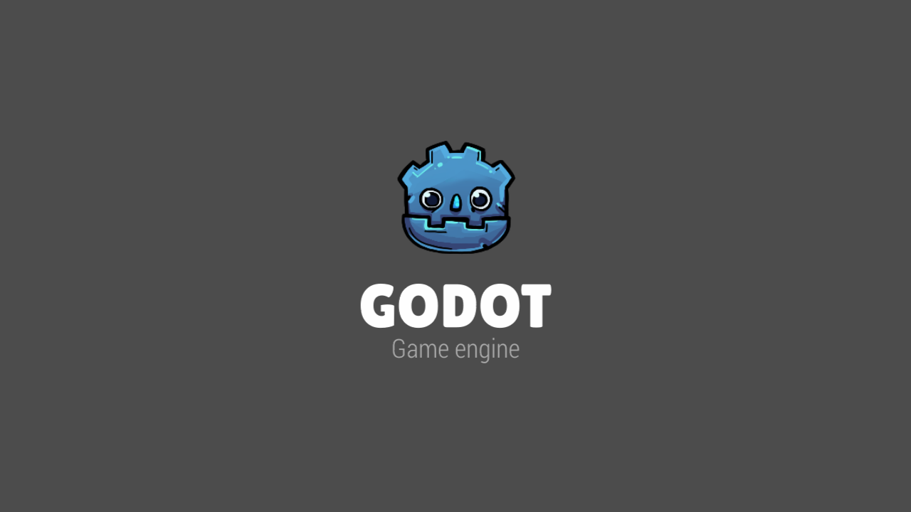

# Custom Godot Splash

Hello! This is a custom, animated Godot splash screen for your game. Originally created for the game [Transmogrify](https://playtransmogrify.com/).

We received many requests to make it publicly available, and here we are. 

This project can be used as is, but can also be used a model for a splash page.

## Structure

`SplashScreen.tscn` has an animator node with two animations:

- `show_studio`, which fades in a "your studio" svg. Replace the image with your studio's logo
- `show_godot`, which has a nice shader and animation for a slick Godot tribute

The script `SplashScreen.gd` makes sure that if any key or button is pressed, including mouse buttons, the animations are skipped. Skipping the first animation goes to the Godot animation. Skipping the Godot animation ends the splashscreen. A `done` signal gets emitted, that you can capture to start your game.

To note: in project settings, the splash page is set to `GodotSplash/blank.png`. This is to avoid having the default Godot logo. However, this splash graphic is what's shown while your game is loading. There are two ways of dealing with that:

1. load your game manually in your own way, and keep the main scene lightweight. This is the best option, but it requires some manual wiring.
2. replace the splash with a "loading" visual. If you decide to do that, you'll find the settings in `Project > Project Settings > Boot Splash`.

## License

The splash screen is released under almost the same license as [the original Godot Logo](https://github.com/godotengine/godot/blob/master/LOGO_LICENSE.md). The original Godot logo uses [CC-BY 3.0](https://creativecommons.org/licenses/by/3.0/legalcode), we use [CC-BY 4.0](https://creativecommons.org/licenses/by/4.0/legalcode). The difference is that 4.0 includes a clause allowing us to ask you to _remove_ our attribution from your usage of the logo, if we didn't want our name associated with it.

### What does CC-BY 4.0 mean?

You can read more about it on [TLDRLegal](https://tldrlegal.com/license/creative-commons-attribution-4.0-international-(cc-by-4)), but basically, it means you can do whatever you want with the splash, as long as you include a credit somewhere.

### Who should I credit, and how?

If you make a gamejam game, no need to credit us. If you make a proper game, with a credit screen, just include a mention somwhere to `Odyssey Entertainment`, as well as the original author of the logo, `Andrea Calabró`.